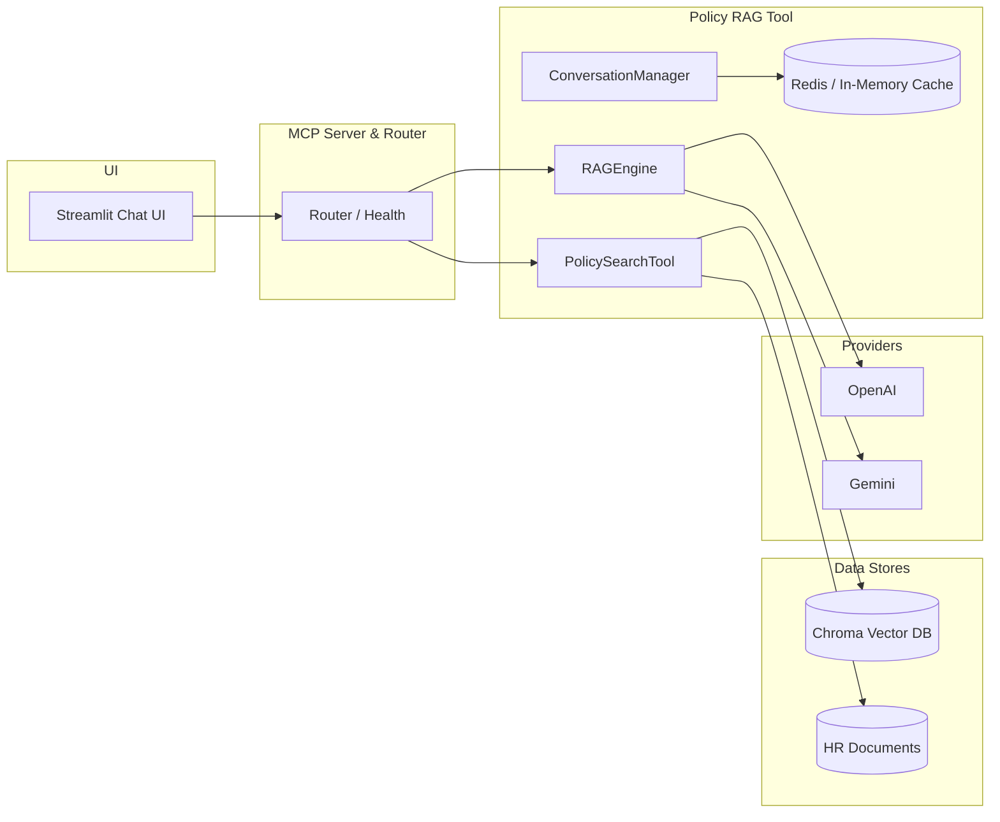
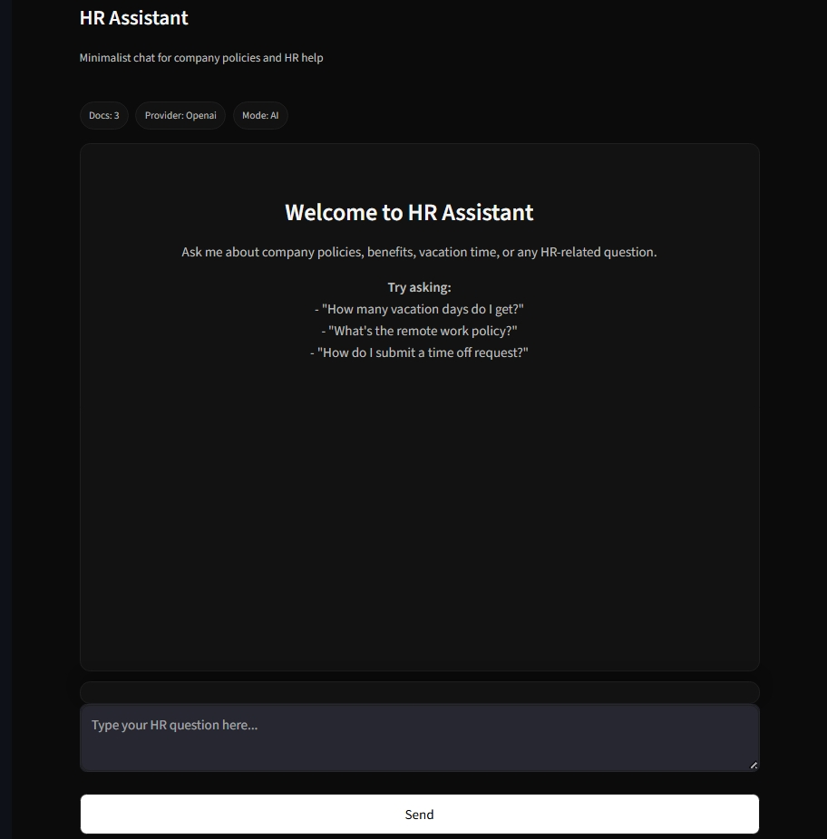

# HR Agent (Model Context Protocol)

[](https://www.linkedin.com/in/sanjan-bm/) [](https://sanjanb.github.io/) [](mailto:sanjanacharaya1234@gmail.com)

A minimalist HR Assistant that answers policy questions from your own documents. It retrieves the most relevant sections from a vector database and generates grounded responses with citations using OpenAI or Gemini. When no LLM is configured, it falls back to a reliable Basic (retrieval‑only) mode.

Although this is a simple project, the architecture and delivery plan follow industry‑level patterns and are deliberately modular and flexible, making it easy to integrate all features discussed in the plan (`docs/plan.md`).

## Features

Quick Links: [Quick Start](#quick-start-windows-powershell) · [Architecture](#architecture-overview) · [How It Works](docs/HOW_IT_WORKS.md) · [HR Policy RAG Feature](docs/FEATURE_HR_POLICY_RAG.md) · [Project Plan](docs/plan.md)

- Grounded answers with explicit citations (RAG)
- Multi‑provider: OpenAI, Gemini, or Auto (prefer → fallback)
- Low‑latency mode (faster models, fewer tokens, lower temperature)
- Conversation summary caching per session (Redis or in‑memory)
- Minimal Streamlit UI with sticky input and streaming responses
- Works even without LLM keys (retrieval‑only Basic mode)

## Why It Wins

- Speed: Warm‑up + low‑latency mode deliver fast first and follow‑up answers.
- Reliability: Functions even with no API keys (retrieval‑only fallback).
- Grounding: Answers always cite sources for trust and auditability.
- Simplicity: One‑screen UI, copyable commands, minimal setup.
- Industry‑grade design: Modular MCP tools, provider‑agnostic, cache‑aware.
- Measurable: Track latency, cache hit‑rate, and retrieval Top‑K choices.

## Architecture Overview

The UI calls an MCP Server that routes to a Policy RAG tool. The tool searches a vector database (Chroma) for relevant chunks and the RAG Engine composes a prompt for the selected LLM provider (or uses retrieval‑only fallback). Conversation summaries are cached to shrink context on follow‑ups.

- Full details: `docs/HOW_IT_WORKS.md`
- Feature guide: `docs/FEATURE_HR_POLICY_RAG.md`



## Prerequisites

- Python 3.8+
- Optional: OpenAI or Gemini API key (for AI responses)
- Optional: Redis (for cross‑process summary caching)

## Quick Start (Windows PowerShell)

```powershell
# 1) Create and activate a virtual environment
python -m venv .venv; .\.venv\Scripts\activate

# 2) Install dependencies
pip install -r requirements.txt

# 3) (Optional) Configure provider for AI responses
set OPENAI_API_KEY=your-openai-key
# or
set GEMINI_API_KEY=your-gemini-key

# 4) Ingest documents (place PDFs/text under data/hr_documents/ first)
python setup.py

# 5) (Optional) Warm-up to reduce first-response latency
python scripts/warmup.py

# 6) Start the UI
streamlit run ui/streamlit_app.py
```

## 5‑Minute Demo Script

1. Start the app:
   ```powershell
   python -m venv .venv; .\.venv\Scripts\activate
   pip install -r requirements.txt
   python setup.py
   streamlit run ui/streamlit_app.py
   ```
2. Ask: "How many vacation days do I get?" → Show citations under the answer.
3. Toggle Low‑latency mode in the sidebar → Ask a follow‑up to show faster response.
4. Switch provider at runtime: type `/provider auto`, then `/provider openai` or `/provider gemini`.
5. Show resilience: unset API key and refresh → app continues in Basic (retrieval‑only) mode.
6. Clear and replay: `/clear` → ask again and point to cached summary speeding context.

## Configuration (Environment)

Core settings:

```bash
# Providers (optional, enables AI responses)
OPENAI_API_KEY=...
GEMINI_API_KEY=...
GEMINI_MODEL=gemini-1.5-pro

# Vector DB & documents
VECTOR_DB_PATH=./data/vector_db
VECTOR_DB_COLLECTION_NAME=hr_policies
HR_DOCUMENTS_PATH=./data/hr_documents
EMBEDDING_MODEL=all-MiniLM-L6-v2

# Redis cache (optional; falls back to in-memory)
REDIS_URL=redis://localhost:6379/0
# or REDIS_HOST, REDIS_PORT, REDIS_DB

# Low-latency tuning (optional)
FAST_OPENAI_MODEL=gpt-3.5-turbo
FAST_GEMINI_MODEL=gemini-1.5-flash
LOW_LATENCY_MAX_TOKENS=350
LOW_LATENCY_TEMPERATURE=0.0
```

## Usage

- Ask questions like: “How many vacation days do I get?”, “What’s the remote work policy?”
- Commands in the input:
  - `/clear` — reset chat
  - `/help` — list commands
  - `/provider openai|gemini|auto` — switch provider at runtime
- Settings (sidebar → Settings):
  - Search results (Top‑K)
  - Low‑latency mode (prefer faster models or Basic)
  - Fast responses (smaller retrieval context for speed)
- Sources are shown beneath answers; retrieval‑only mode indicates document‑based answers without an LLM.

## Performance

This project is optimized for fast startup and quick replies:

- Warm‑up script (`scripts/warmup.py`) primes vector search and the LLM provider
- Low‑latency mode caps tokens, lowers temperature, and uses faster models
- Conversation summary caching (Redis or in‑memory) shrinks prompts on follow‑ups
- “Fast responses” limits Top‑K to reduce retrieval/LLM input size
- Streaming renderer shows results progressively for snappy UX

## Key Differentiators

- Provider‑agnostic RAG: Seamlessly switch between OpenAI, Gemini, or Auto.
- Resilient by design: Works in offline/keys‑missing scenarios via Basic mode.
- Performance‑first: Warm‑up, low‑latency tuning, and cache‑aware prompts.
- Grounded outputs: Always with citations and source visibility.
- Minimal ops burden: Single service, simple env vars, optional Redis.

## Screenshot



## Caching

- Per‑session conversation summaries are cached at key `conv:summary:<user_id>` (≈30 minutes)
- Uses Redis if available; otherwise a per‑process in‑memory fallback
- Summaries are combined with only the most recent turns to reduce LLM prompt size

## Security & Privacy

- Data locality: Documents remain local; only minimal prompts are sent to providers.
- Secrets: API keys are provided via environment variables; no keys stored in code.
- Optional cache: Redis is local by default; if unavailable, in‑memory fallback is used.
- No PII retention: Conversation summaries are short‑lived (≈30 minutes by default).

## Project Structure

```
mcp-agent/
├── mcp_server/             # MCP server and router
├── tools/
│   ├── policy_rag/
│   │   ├── document_processor.py
│   │   ├── vector_database.py
│   │   ├── mcp_tool.py              # PolicySearchTool (search/stats)
│   │   └── rag_engine.py            # RAGEngine + ConversationManager
│   └── cache/
│       └── redis_cache.py           # Redis or in-memory JSON cache
├── ui/
│   └── streamlit_app.py             # Minimal chat UI
├── scripts/
│   └── warmup.py                    # Startup warm-up
├── data/
│   ├── hr_documents/                # Your PDFs/text
│   └── vector_db/                   # Chroma index
├── docs/
│   ├── HOW_IT_WORKS.md              # Architecture & data flow
│   └── FEATURE_HR_POLICY_RAG.md     # Feature guide
├── requirements.txt
└── setup.py
```

## Extensibility & Future Work

- Add providers: Plug in additional LLMs by extending the provider adapter.
- New tools: Add MCP tools (e.g., resume screening, onboarding) without touching the UI.
- Storage swaps: Replace Chroma or Redis with managed equivalents with minimal changes.
- Guided roadmap: See `docs/plan.md` for feature backlog and sequencing.

## Troubleshooting

- No AI responses: set `OPENAI_API_KEY` or `GEMINI_API_KEY`; the app will otherwise use Basic mode
- No documents found: add files to `data/hr_documents/` and run `python setup.py`
- Slow first response: run `python scripts/warmup.py` and enable Low‑latency mode
- Cache warnings: if Redis is not reachable, in‑memory fallback is used automatically

## Roadmap (Indicative)

- Inline citation markers [1][2] with copy/open
- Conversation persistence and export (JSON/Markdown)
- Light theme toggle and accessibility polish
- Optional recruiter “Resume Screening” and “Onboarding” tools

---

For full technical detail, see `docs/HOW_IT_WORKS.md` and `docs/FEATURE_HR_POLICY_RAG.md`.
