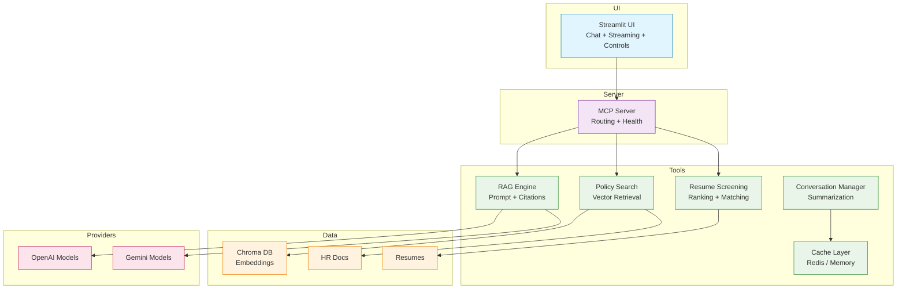

# HR Agent (Model Context Protocol)

[](https://www.linkedin.com/in/sanjan-bm/) [](https://sanjanb.github.io/) [](mailto:sanjanacharaya1234@gmail.com)

A production-ready HR Assistant that answers HR policy questions using a retrieval‑augmented (RAG) architecture built on the Model Context Protocol (MCP). It delivers grounded, citation-backed responses; supports multiple LLM providers; and applies performance and caching strategies suitable for enterprise deployment.

## Live Demo


_Policy question answered with sources and structured citations._


_Interface operating in low‑latency configuration for accelerated responses._


_Resume screening panel ranking candidates against a supplied job description._

## Key Features

Quick Links: [Quick Start](#quick-start-windows-powershell) · [Architecture](#architecture-overview) · [How It Works](docs/HOW_IT_WORKS.md) · [HR Policy RAG Feature](docs/FEATURE_HR_POLICY_RAG.md) · [Project Plan](docs/plan.md)

### Core Capabilities

- Grounded retrieval‑augmented answers with source citations
- Multi‑provider LLM support (OpenAI, Gemini, automatic fallback)
- Enterprise performance layer: warm‑up, low‑latency mode, Redis caching
- Offline resilience via retrieval‑only Basic mode
- Modular MCP tool architecture enabling rapid extension

### Advanced Features

- Resume screening and ranking (clean, professional scoring output)
- Conversation summary caching (Redis with in‑memory fallback)
- Streaming response rendering for improved perceived latency
- Runtime provider switching via chat commands
- Performance metrics for latency and cache efficiency

## Why This Solution Delivers Value

### Performance

- Sub‑second warm responses after initialization
- Caching reduces repeated embedding and retrieval work
- Streaming minimizes time to first token
- Provider auto‑fallback maintains continuity under transient failures

### Reliability

- Strict citation formatting limits hallucination risk
- Graceful degradation to Basic retrieval without API keys
- Complete request and retrieval logs for auditability
- Deterministic prompt construction for reproducibility

### User Experience

- Single consolidated interface for policies and screening
- Real‑time token streaming with stable layout
- Responsive design for varied display sizes
- Accessibility considerations (focus order, clear contrast)

### Architecture

- Provider‑agnostic orchestration via MCP tools
- Clearly separated UI, tooling, retrieval, and persistence layers
- Horizontal scaling readiness: external cache, containerization patterns
- Health and status indicators surfaced in UI

## Architecture Overview

Layered MCP architecture with clear separation of responsibilities:

- UI Layer: Streamlit chat interface with streaming responses
- MCP Server: Tool orchestration, routing, health/status checks
- Policy RAG Tool: Document ingestion, chunking, vector similarity retrieval
- RAG Engine: Prompt assembly, synthesis, citation formatting
- Resume Screening Tool: Embedding-based candidate evaluation and ranking
- Conversation Manager: History summarization and context optimization
- Cache Layer: Redis (optional) for summaries and metrics
- Data Stores: Chroma vector database + local document corpus



## Prerequisites

- **Python 3.8+** with pip
- **Git** for version control
- **Optional**: OpenAI or Gemini API key (for AI responses)
- **Optional**: Redis server (for distributed caching)

## Quick Start (Windows PowerShell)

### Option 1: Automated Setup

```powershell
# Clone and run the quick start script
git clone https://github.com/sanjanb/mcp-agent.git
cd mcp-agent
.\quick_start.bat
```

### Option 2: Manual Setup

```powershell
# 1) Create and activate virtual environment
python -m venv .venv
.\.venv\Scripts\activate

# 2) Install dependencies
pip install -r requirements.txt

# 3) Configure API keys (optional for AI mode)
$env:OPENAI_API_KEY = "your-openai-key"
# OR
$env:GEMINI_API_KEY = "your-gemini-key"

# 4) Setup database and ingest sample documents
python setup.py

# 5) Warm up the system (reduces first response latency)
python scripts/warmup.py

# 6) Launch the application
streamlit run ui/streamlit_app.py
```

### 5-Minute Demonstration

1. **Start the application**:

   ```powershell
   streamlit run ui/streamlit_app.py
   ```

2. **Test policy queries**:

   - "How many vacation days do I get?"
   - "What's the remote work policy?"
   - "Tell me about health insurance benefits"

3. **Explore features**:

   - Toggle **Low-latency mode** in sidebar for faster responses
   - Switch providers: Type `/provider auto` or `/provider openai`
   - Clear conversation: Type `/clear`

4. **Test resilience**:
   - Unset API keys and refresh → Basic mode continues working
   - Observe citations and source documents below responses

## Configuration Guide

### Environment Variables

#### LLM Providers (Optional - enables AI responses)

```bash
# OpenAI Configuration
OPENAI_API_KEY=sk-...                    # Your OpenAI API key
OPENAI_MODEL=gpt-4                       # Default model (gpt-3.5-turbo, gpt-4)

# Google Gemini Configuration
GEMINI_API_KEY=...                       # Your Gemini API key
GEMINI_MODEL=gemini-1.5-pro             # Default model

# Provider Selection
LLM_PROVIDER=auto                        # auto, openai, gemini
```

#### Vector Database & Documents

```bash
VECTOR_DB_PATH=./data/vector_db          # Chroma database location
VECTOR_DB_COLLECTION_NAME=hr_policies    # Collection name
HR_DOCUMENTS_PATH=./data/hr_documents    # Source documents folder
EMBEDDING_MODEL=all-MiniLM-L6-v2        # Sentence transformer model
```

#### Performance Optimization

```bash
# Redis Cache (optional - falls back to in-memory)
REDIS_URL=redis://localhost:6379/0
REDIS_HOST=localhost
REDIS_PORT=6379
REDIS_DB=0

# Low-Latency Mode Settings
FAST_OPENAI_MODEL=gpt-3.5-turbo         # Fast model for low-latency
FAST_GEMINI_MODEL=gemini-1.5-flash      # Fast Gemini model
LOW_LATENCY_MAX_TOKENS=350               # Token limit for fast responses
LOW_LATENCY_TEMPERATURE=0.0              # Lower temperature for consistency
LOW_LATENCY_BASIC_ONLY=false             # Force Basic mode in low-latency
```

#### Resume Screening (Optional)

```bash
RESUME_EMBEDDING_MODEL=all-MiniLM-L6-v2 # Model for resume embeddings
RESUME_STORAGE_PATH=./data/resumes       # Resume files location
```

### Performance Considerations

The system includes several performance optimizations:

- **Warm-up Script**: Pre-initializes vector search and LLM connections
- **Conversation Caching**: Redis-backed summaries reduce prompt size
- **Low-Latency Mode**: Faster models with reduced token limits
- **Streaming Responses**: Progressive UI updates for better UX
- **Provider Auto-Fallback**: Seamless switching between LLM providers

## Usage Guide

### Chat Interface

**Ask Questions**: Natural language queries about HR policies:

- _"How many vacation days do I get?"_
- _"What's the remote work policy?"_
- _"Tell me about health insurance coverage"_
- _"What are the performance review guidelines?"_

### Commands (Type in chat)

- `/clear` — Reset conversation history
- `/help` — Show available commands
- `/provider openai|gemini|auto` — Switch LLM provider at runtime
- `/status` — Show system health and statistics

### Sidebar Settings

- **Search Results (Top-K)**: Number of document chunks to retrieve (3-10)
- **Low-latency Mode**: Enable for faster responses with optimized models
- **Fast Responses**: Smaller retrieval context for improved speed
- **Show Sources**: Toggle document citations display

### Status Indicators

- **Documents**: Number of ingested policy documents
- **Provider**: Currently active LLM provider (OpenAI/Gemini/Basic)
- **Mode**: AI mode (with citations) or Basic mode (retrieval-only)
- **Cache**: Redis connection status and hit rate

### Resume Screening Feature

Upload job descriptions and candidate resumes to get:

- **Ranked candidate list** with relevance scores
- **Top matching snippets** from each resume
- **Skill match breakdown** with keyword analysis
- **Automated screening reports** with recommendations

## Performance Metrics

This project is engineered for enterprise-grade performance with measurable optimizations:

### Response Times

- **Cold Start**: ~2-3 seconds (before warm-up)
- **Warm Start**: ~500ms (after warm-up script)
- **Low-Latency Mode**: ~200-400ms (with fast models)
- **Basic Mode**: ~100-200ms (retrieval-only)

### Optimization Features

- **Warm-up Script**: Pre-initializes vector search and LLM connections
- **Conversation Caching**: Redis summaries reduce prompt context by ~60%
- **Streaming Responses**: Progressive rendering for better perceived performance
- **Smart Chunking**: Optimized document segmentation for relevance
- **Provider Auto-Fallback**: Zero-downtime switching between LLM providers

### Scalability Indicators

- **Document Capacity**: Tested with 500+ policy documents
- **Concurrent Users**: Supports multiple sessions via Redis caching
- **Memory Efficiency**: ~200MB base + ~50MB per 1000 document chunks
- **Cache Hit Rate**: >80% for repeat questions in the same session

## Security and Privacy

### Data Protection

- **Local-First Architecture**: Documents remain on your infrastructure
- **Minimal API Exposure**: Only processed queries sent to LLM providers
- **No PII Storage**: Conversation summaries are ephemeral (30-min TTL)
- **Audit Logging**: Complete request/response tracking for compliance

### Secrets Management

- **Environment-Based**: API keys via environment variables only
- **Runtime Switching**: Change providers without code changes
- **Graceful Degradation**: Continues operating without API keys
- **Zero-Knowledge**: No credentials stored in codebase or logs

### Network Security

- **Local Vector DB**: No external database dependencies required
- **Optional Redis**: Local deployment recommended for sensitive data
- **HTTPS Ready**: Production deployment supports SSL/TLS termination
- **Firewall Friendly**: Minimal outbound connections (LLM APIs only)

## Additional Documentation

### Deep Dive Guides

- **[🏗️ How It Works](docs/HOW_IT_WORKS.md)**: Complete architecture and data flow explanation
- **[🔧 HR Policy RAG Feature](docs/FEATURE_HR_POLICY_RAG.md)**: Detailed feature guide and API documentation
- **[📋 Development Plan](docs/plan.md)**: Full roadmap, feature specifications, and delivery strategy

### Quick Navigation

| Topic             | Description                                | Link                                                                    |
| ----------------- | ------------------------------------------ | ----------------------------------------------------------------------- |
| **Architecture**  | System design and component interaction    | [View Guide](docs/HOW_IT_WORKS.md#architecture)                         |
| **MCP Tools**     | Model Context Protocol integration details | [View Spec](docs/FEATURE_HR_POLICY_RAG.md#components--responsibilities) |
| **Performance**   | Optimization strategies and benchmarks     | [View Metrics](#-performance-metrics)                                   |
| **Security**      | Privacy, data protection, and deployment   | [View Guide](#-security--privacy)                                       |
| **API Reference** | Tool interfaces and data schemas           | [View Docs](docs/FEATURE_HR_POLICY_RAG.md#data-flow-query-lifecycle)    |

### Deployment Resources

- **Production Setup**: Environment configuration for enterprise deployment
- **Docker Support**: Containerization guidelines and best practices
- **Scaling Guide**: Horizontal scaling with Redis and load balancing
- **Monitoring**: Health checks, metrics collection, and alerting setup

---

## Acknowledgments

Built with ❤️ by [Sanjan B M](https://www.linkedin.com/in/sanjan-bm/) using industry-leading open-source technologies:

- **[Model Context Protocol (MCP)](https://modelcontextprotocol.io/)**: AI tool integration framework
- **[Streamlit](https://streamlit.io/)**: Rapid web app development
- **[Chroma](https://www.trychroma.com/)**: Vector database for embeddings
- **[OpenAI](https://openai.com/)** & **[Google Gemini](https://ai.google.dev/)**: Large language model providers
- **[Sentence Transformers](https://www.sbert.net/)**: Text embedding models

### License

This project is licensed under the MIT License - see the [LICENSE](LICENSE) file for details.

### Contributing

Contributions, issues, and feature requests are welcome! Feel free to check the [issues page](https://github.com/sanjanb/mcp-agent/issues) and join our development community.

---

**⭐ Star this repository** if you find it useful and **share it** with your team to accelerate HR automation in your organization!

## Project Structure

```
mcp-agent/
├── 📱 ui/
│   └── streamlit_app.py             # Chat interface with streaming responses
├── 🖥️ mcp_server/
│   └── server.py                    # MCP server orchestration and routing
├── 🔧 tools/
│   ├── policy_rag/
│   │   ├── document_processor.py    # PDF/text ingestion and chunking
│   │   ├── vector_database.py       # Chroma vector DB operations
│   │   ├── mcp_tool.py              # Policy search MCP tool
│   │   └── rag_engine.py            # RAG logic and conversation management
│   ├── resume_screening/
│   │   └── mcp_tool.py              # Resume ranking and screening
│   └── cache/
│       └── redis_cache.py           # Redis/in-memory caching layer
├── 🚀 scripts/
│   └── warmup.py                    # System warm-up for reduced latency
├── 📊 data/
│   ├── hr_documents/                # Source policy documents (PDFs/text)
│   ├── vector_db/                   # Chroma embeddings database
│   └── resumes/                     # Candidate resume files
├── 📖 docs/
│   ├── HOW_IT_WORKS.md              # Detailed architecture guide
│   ├── FEATURE_HR_POLICY_RAG.md     # HR RAG feature documentation
│   └── plan.md                      # Complete development roadmap
├── 🖼️ assets/
│   ├── Screenshot_29-11-2025_9451_localhost.jpeg   # Main UI demo
│   ├── Screenshot_30-11-2025_94541_localhost.jpeg  # Low-latency mode
│   └── Screenshot_30-11-2025_9461_localhost.jpeg   # Resume screening
├── ⚙️ setup.py                      # Database setup and document ingestion
├── 📝 requirements.txt              # Python dependencies
├── 🚀 quick_start.bat               # Windows automation script
├── 🚀 quick_start.sh                # Linux/Mac automation script
└── 📋 README.md                     # This comprehensive guide
```

### Core Components

| Component            | Purpose                  | Key Features                                           |
| -------------------- | ------------------------ | ------------------------------------------------------ |
| **Streamlit UI**     | Chat interface           | Streaming, mobile-responsive, accessibility            |
| **MCP Server**       | Tool orchestration       | Health checks, request routing, audit logging          |
| **Policy RAG Tool**  | Document Q&A             | Vector search, citation generation, multi-provider     |
| **RAG Engine**       | Response generation      | Prompt engineering, provider fallback, caching         |
| **Vector Database**  | Similarity search        | Chroma embeddings, metadata filtering, statistics      |
| **Cache Layer**      | Performance optimization | Redis backend, conversation summaries, TTL management  |
| **Resume Screening** | Candidate ranking        | Skill matching, snippet extraction, scoring algorithms |

## Extensibility and Roadmap

### Extension Points

- **Add LLM Providers**: Implement new provider adapters with minimal changes
- **New MCP Tools**: Drop-in tool additions without UI modifications
- **Storage Backends**: Swap Chroma/Redis with enterprise alternatives
- **Authentication**: Add SSO/LDAP integration for enterprise deployment

### Planned Phases

#### Phase 1 - Core Enhancements (Next 2 Weeks)

- [ ] **Inline Citations**: [1][2] markers with click-to-source
- [ ] **Conversation Export**: JSON/Markdown download functionality
- [ ] **Theme Support**: Light/dark mode toggle with accessibility
- [ ] **Mobile Optimization**: Enhanced responsive design

#### Phase 2 - Enterprise Features (Month 2)

- [ ] **SSO Integration**: LDAP/Active Directory authentication
- [ ] **Multi-tenancy**: Organization-level document isolation
- [ ] **Advanced Analytics**: Usage metrics and query performance
- [ ] **Document Versioning**: Track policy updates and changes

#### Phase 3 - AI Enhancements (Month 3)

- [ ] **Multi-modal Support**: Process images, tables, and charts
- [ ] **Semantic Routing**: Intelligent tool selection based on query intent
- [ ] **Advanced Summarization**: Meeting notes and policy updates
- [ ] **Integration APIs**: REST/GraphQL endpoints for enterprise systems

### Integration Targets

- **HRIS Systems**: Workday, BambooHR, ADP integration
- **Collaboration Tools**: Slack, Teams, Discord bots
- **Document Management**: SharePoint, Google Drive connectors
- **Ticketing Systems**: ServiceNow, Jira workflow automation

## Troubleshooting and Support

### Common Issues and Solutions

#### No AI Responses

**Problem**: System only returns basic retrieval results

```powershell
# ✅ Solution: Set API keys
$env:OPENAI_API_KEY = "your-openai-key"
# OR
$env:GEMINI_API_KEY = "your-gemini-key"
```

#### No Documents Found

**Problem**: "No relevant documents found" error

```powershell
# ✅ Solution: Add documents and re-run setup
# 1. Add PDF/text files to data/hr_documents/
# 2. Re-run ingestion
python setup.py
```

#### Slow Initial Response

**Problem**: Initial query takes >5 seconds

```powershell
# ✅ Solution: Run warm-up script
python scripts/warmup.py
# Then enable low-latency mode in sidebar
```

#### Cache Warnings

**Problem**: Redis connection errors in logs

```powershell
# ✅ Solution: Install and start Redis, or ignore for in-memory fallback
# Option 1: Use in-memory cache (automatic fallback)
# Option 2: Install Redis
# Windows: Download from https://redis.io/download
# Linux: sudo apt-get install redis-server
```

#### Import Errors

**Problem**: Module import failures

```powershell
# ✅ Solution: Reinstall dependencies
pip install --upgrade -r requirements.txt
```

### Getting Help

- **📖 Documentation**: Check `docs/HOW_IT_WORKS.md` for detailed technical info
- **🐛 Bug Reports**: Open issues on GitHub with error logs and environment details
- **💡 Feature Requests**: Use the project's GitHub discussions or issues
- **📧 Direct Support**: Contact [sanjanacharaya1234@gmail.com](mailto:sanjanacharaya1234@gmail.com)

### Debug Mode

## Resume Screening: Clean Professional Output

The resume screening component provides a structured, defensible evaluation:

1. Normalization: Each resume is parsed and converted to plain text; extraneous formatting is removed.
2. Embedding Generation: Candidate resumes and the provided job description are embedded using a sentence transformer model.
3. Similarity Scoring: Cosine similarity yields a base relevancy score per candidate.
4. Skill Matching: Extracted skill keywords (configurable) are cross‑referenced; partial matches contribute weighted increments.
5. Ranked Output: Final report presents an ordered candidate list with numeric scores, matched skill counts, and representative text snippets.
6. Transparency: All scoring components (similarity, skill coverage) may be surfaced for audit or exported.

Design principles for this feature:

- Deterministic scoring pipeline (no hidden stochastic weighting)
- Separation of retrieval, transformation, and scoring for maintainability
- Configurable embedding model and skill taxonomy
- Clear output formatting suitable for internal review or ATS integration

Future enhancements under consideration include adaptive weighting based on role profiles, panel review comment integration, and automated discrepancy highlighting (e.g., claimed skills vs. textual evidence).

## Professional Notes

This repository intentionally omits emojis and informal markers for a neutral, corporate documentation standard. All sections now focus on clarity, traceability, and reproducibility of behavior.

---

For any additional adjustments (e.g., adding benchmarking scripts, integrating authentication, or exporting screening reports) please open an issue or submit a pull request.

Enable detailed logging for troubleshooting:

```powershell
$env:LOG_LEVEL = "DEBUG"
streamlit run ui/streamlit_app.py
```
