# HR Agent (Model Context Protocol)

A minimalist HR Assistant that answers policy questions from your own documents. It retrieves the most relevant sections from a vector database and generates grounded responses with citations using OpenAI or Gemini. When no LLM is configured, it falls back to a reliable Basic (retrieval‑only) mode.

Although this is a simple project, the architecture and delivery plan follow industry‑level patterns and are deliberately modular and flexible, making it easy to integrate all features discussed in the plan (`docs/plan.md`).

## Features

Quick Links: [Quick Start](#quick-start-windows-powershell) · [Architecture](#architecture-overview) · [How It Works](docs/HOW_IT_WORKS.md) · [HR Policy RAG Feature](docs/FEATURE_HR_POLICY_RAG.md) · [Project Plan](docs/plan.md)

- Grounded answers with explicit citations (RAG)
- Multi‑provider: OpenAI, Gemini, or Auto (prefer → fallback)
- Low‑latency mode (faster models, fewer tokens, lower temperature)
- Conversation summary caching per session (Redis or in‑memory)
- Minimal Streamlit UI with sticky input and streaming responses
- Works even without LLM keys (retrieval‑only Basic mode)

## Architecture Overview

The UI calls an MCP Server that routes to a Policy RAG tool. The tool searches a vector database (Chroma) for relevant chunks and the RAG Engine composes a prompt for the selected LLM provider (or uses retrieval‑only fallback). Conversation summaries are cached to shrink context on follow‑ups.

- Full details: `docs/HOW_IT_WORKS.md`
- Feature guide: `docs/FEATURE_HR_POLICY_RAG.md`

```mermaid
flowchart LR
   subgraph UI
      ST["Streamlit Chat UI"]
   end

   subgraph MCP["MCP Server & Router"]
      Router[Router / Health]
   end

   subgraph TOOLS["Policy RAG Tool"]
      PS[PolicySearchTool]
      RAG[RAGEngine]
      CONV[ConversationManager]
      CACHE[(Redis / In‑Memory Cache)]
   end

   subgraph DATA["Data Stores"]
      CHROMA[(Chroma Vector DB)]
      DOCS[(HR Documents)]
   end

   subgraph LLM["Providers"]
      OPENAI[OpenAI]
      GEMINI[Gemini]
   end

   ST --> Router
   Router --> PS
   Router --> RAG
   PS --> CHROMA
   PS --> DOCS
   RAG --> OPENAI
   RAG --> GEMINI
   CONV --> CACHE
```



## Prerequisites

- Python 3.8+
- Optional: OpenAI or Gemini API key (for AI responses)
- Optional: Redis (for cross‑process summary caching)

## Quick Start (Windows PowerShell)

```powershell
# 1) Create and activate a virtual environment
python -m venv .venv; .\.venv\Scripts\activate

# 2) Install dependencies
pip install -r requirements.txt

# 3) (Optional) Configure provider for AI responses
set OPENAI_API_KEY=your-openai-key
# or
set GEMINI_API_KEY=your-gemini-key

# 4) Ingest documents (place PDFs/text under data/hr_documents/ first)
python setup.py

# 5) (Optional) Warm-up to reduce first-response latency
python scripts/warmup.py

# 6) Start the UI
streamlit run ui/streamlit_app.py
```

## Configuration (Environment)

Core settings:

```bash
# Providers (optional, enables AI responses)
OPENAI_API_KEY=...
GEMINI_API_KEY=...
GEMINI_MODEL=gemini-1.5-pro

# Vector DB & documents
VECTOR_DB_PATH=./data/vector_db
VECTOR_DB_COLLECTION_NAME=hr_policies
HR_DOCUMENTS_PATH=./data/hr_documents
EMBEDDING_MODEL=all-MiniLM-L6-v2

# Redis cache (optional; falls back to in-memory)
REDIS_URL=redis://localhost:6379/0
# or REDIS_HOST, REDIS_PORT, REDIS_DB

# Low-latency tuning (optional)
FAST_OPENAI_MODEL=gpt-3.5-turbo
FAST_GEMINI_MODEL=gemini-1.5-flash
LOW_LATENCY_MAX_TOKENS=350
LOW_LATENCY_TEMPERATURE=0.0
```

## Usage

- Ask questions like: “How many vacation days do I get?”, “What’s the remote work policy?”
- Commands in the input:
  - `/clear` — reset chat
  - `/help` — list commands
  - `/provider openai|gemini|auto` — switch provider at runtime
- Settings (sidebar → Settings):
  - Search results (Top‑K)
  - Low‑latency mode (prefer faster models or Basic)
  - Fast responses (smaller retrieval context for speed)
- Sources are shown beneath answers; retrieval‑only mode indicates document‑based answers without an LLM.

## Performance

This project is optimized for fast startup and quick replies:

- Warm‑up script (`scripts/warmup.py`) primes vector search and the LLM provider
- Low‑latency mode caps tokens, lowers temperature, and uses faster models
- Conversation summary caching (Redis or in‑memory) shrinks prompts on follow‑ups
- “Fast responses” limits Top‑K to reduce retrieval/LLM input size
- Streaming renderer shows results progressively for snappy UX

## Caching

- Per‑session conversation summaries are cached at key `conv:summary:<user_id>` (≈30 minutes)
- Uses Redis if available; otherwise a per‑process in‑memory fallback
- Summaries are combined with only the most recent turns to reduce LLM prompt size

## Project Structure

```
mcp-agent/
├── mcp_server/             # MCP server and router
├── tools/
│   ├── policy_rag/
│   │   ├── document_processor.py
│   │   ├── vector_database.py
│   │   ├── mcp_tool.py              # PolicySearchTool (search/stats)
│   │   └── rag_engine.py            # RAGEngine + ConversationManager
│   └── cache/
│       └── redis_cache.py           # Redis or in-memory JSON cache
├── ui/
│   └── streamlit_app.py             # Minimal chat UI
├── scripts/
│   └── warmup.py                    # Startup warm-up
├── data/
│   ├── hr_documents/                # Your PDFs/text
│   └── vector_db/                   # Chroma index
├── docs/
│   ├── HOW_IT_WORKS.md              # Architecture & data flow
│   └── FEATURE_HR_POLICY_RAG.md     # Feature guide
├── requirements.txt
└── setup.py
```

## Troubleshooting

- No AI responses: set `OPENAI_API_KEY` or `GEMINI_API_KEY`; the app will otherwise use Basic mode
- No documents found: add files to `data/hr_documents/` and run `python setup.py`
- Slow first response: run `python scripts/warmup.py` and enable Low‑latency mode
- Cache warnings: if Redis is not reachable, in‑memory fallback is used automatically

## Roadmap (Indicative)

- Inline citation markers [1][2] with copy/open
- Conversation persistence and export (JSON/Markdown)
- Light theme toggle and accessibility polish
- Optional recruiter “Resume Screening” and “Onboarding” tools

---

For full technical detail, see `docs/HOW_IT_WORKS.md` and `docs/FEATURE_HR_POLICY_RAG.md`.

# HR Agent MCP Project

An HR Assistant that answers policy questions from your documents. It retrieves relevant sections from a vector database and generates grounded responses with citations via OpenAI or Gemini. Falls back to a Basic (retrieval‑only) mode if no provider is configured.

## At a Glance

- Grounded answers with citations (RAG)
- Providers: OpenAI, Gemini, or Auto (prefer → fallback)
- Low‑latency mode (faster models, fewer tokens)
- Summary caching per session (Redis or in‑memory)
- Sticky input + streaming responses for fast UX

Quick start (Windows PowerShell):

```powershell
python -m venv .venv; .\.venv\Scripts\activate
pip install -r requirements.txt
set OPENAI_API_KEY=your-openai-key  # or set GEMINI_API_KEY
python setup.py
python scripts/warmup.py   # optional
streamlit run ui/streamlit_app.py
```

Docs: see `docs/HOW_IT_WORKS.md` (architecture & data flow) and `docs/FEATURE_HR_POLICY_RAG.md` (feature‑specific guide).

## 🏗️ Architecture

Based on your comprehensive description, here's an architecture image that visualizes your proposed AI Agent Platform. I've focused on clarity, modularity, and highlighting the shared infrastructure as well as the distinct feature pipelines.


## 🚀 Quick Start

### Prerequisites

- Python 3.8+
- OpenAI API key

### Option 1: Automated Setup (Windows)

```bash
.\quick_start.bat
```

### Option 2: Automated Setup (Linux/Mac)

```bash
chmod +x quick_start.sh
./quick_start.sh
```

### Option 3: Manual Setup

1. **Clone and setup environment:**

   ```bash
   python -m venv venv
   # Windows:
   venv\Scripts\activate
   # Linux/Mac:
   source venv/bin/activate
   ```

2. **Install dependencies:**

   ```bash
   pip install -r requirements.txt
   ```

3. **Set OpenAI API key:**

   ```bash
   # Windows:
   set OPENAI_API_KEY=your-key-here
   # Linux/Mac:
   export OPENAI_API_KEY='your-key-here'
   ```

4. **Initialize the system:**

   ```bash
   python setup.py
   ```

5. **Start the HR Assistant:**
   ```bash
   streamlit run ui/streamlit_app.py
   ```

## 📁 Project Structure

```
mcp-agent/
├── mcp_server/           # MCP orchestration server
│   └── server.py        # Main MCP server with routing
├── tools/               # MCP tools (microservices)
│   ├── policy_rag/      # HR Policy RAG agent
│   │   ├── document_processor.py
│   │   ├── vector_database.py
│   │   ├── mcp_tool.py
│   │   └── rag_engine.py
│   ├── resume_screening/ # (Future: Resume screening)
│   └── onboarding/      # (Future: Onboarding agent)
├── data/                # Document storage
│   ├── hr_documents/    # HR policy documents
│   └── vector_db/       # Chroma vector database
├── ui/                  # User interfaces
│   └── streamlit_app.py # Main chat interface
├── docs/                # Documentation
├── requirements.txt     # Python dependencies
├── setup.py            # System initialization
└── .env.example        # Environment configuration
```

## 🎯 Features Implemented

### ✅ Feature 1: HR Policy RAG Agent (MVP)

**What it does:**

- Answers employee HR questions using company policy documents
- Provides grounded responses with citations
- Maintains conversation context
- Real-time vector similarity search

**Components:**

- **Document Processor**: Converts PDFs/text to searchable chunks
- **Vector Database**: Chroma DB for semantic search
- **MCP Tool**: `policy_search` for document retrieval
- **RAG Engine**: OpenAI-powered response generation
- **Chat UI**: Streamlit interface for employees

**Example queries:**

- "How many vacation days do I get?"
- "What's the remote work policy?"
- "How do I request sick leave?"
- "What health benefits are available?"

### 🔮 Planned Features

**Feature 2: Resume Screening Agent**

- Rank candidate resumes against job descriptions
- Semantic matching and skill extraction
- Bias mitigation and fair screening

**Feature 3: Onboarding Agent**

- Guide new hires through onboarding tasks
- Checklist management and progress tracking
- Integration with IT/HR systems

## 🛠️ Technical Details

### MCP (Model Context Protocol) Architecture

- **Server**: Central orchestrator handling tool calls and routing
- **Tools**: Microservices for specific HR functions
- **Router**: Authentication, authorization, and audit logging
- **Manifest**: Tool registry and capability discovery

### RAG (Retrieval Augmented Generation)

- **Embeddings**: Sentence-transformers for semantic search
- **Chunking**: Smart text splitting with overlap for context
- **Retrieval**: Vector similarity search in Chroma DB
- **Generation**: OpenAI GPT for grounded responses with citations

### Data Flow

```
User Query → MCP Server → policy_search Tool → Vector DB →
Relevant Chunks → RAG Engine → LLM → Cited Response → UI
```

## 📊 System Status

The setup script will show:

- ✅ Document processing status
- ✅ Vector database initialization
- ✅ MCP server health check
- ✅ Tool registration confirmation

## 🔧 Configuration

### Environment Variables (`.env`)

```bash
OPENAI_API_KEY=your_openai_api_key_here
VECTOR_DB_PATH=./data/vector_db
VECTOR_DB_COLLECTION_NAME=hr_policies
HR_DOCUMENTS_PATH=./data/hr_documents
EMBEDDING_MODEL=all-MiniLM-L6-v2
# Optional: Gemini
GEMINI_API_KEY=your_gemini_api_key_here
GEMINI_MODEL=gemini-1.5-pro

# Redis cache (for conversation summaries)
REDIS_URL=redis://localhost:6379/0
# or
# REDIS_HOST=localhost
# REDIS_PORT=6379
# REDIS_DB=0

# Low-latency tuning
FAST_OPENAI_MODEL=gpt-3.5-turbo
FAST_GEMINI_MODEL=gemini-1.5-flash
LOW_LATENCY_MAX_TOKENS=350
LOW_LATENCY_TEMPERATURE=0.0
# Force basic-only in low-latency (fallback search)
# LOW_LATENCY_BASIC_ONLY=true
```

### Adding Your Own HR Documents

1. Place PDF or text files in `data/hr_documents/`
2. Run: `python setup.py` to reprocess
3. Restart the UI: `streamlit run ui/streamlit_app.py`

## 🧪 Testing

### Test Individual Components

```bash
# Test vector database
python tools/policy_rag/vector_database.py

# Test MCP server
python mcp_server/server.py

# Test RAG engine
python tools/policy_rag/rag_engine.py
```

### Test End-to-End Flow

1. Start the UI: `streamlit run ui/streamlit_app.py`
2. Ask a question: "How many vacation days do I get?"
3. Verify response includes citations
4. Check debug info in sidebar

## ⚡ Warm-up (reduce first-response latency)

Run the warm-up script before starting Streamlit to pre-initialize the vector index and the LLM provider:

```powershell
python scripts/warmup.py
```

Then start the app:

```powershell
streamlit run ui/streamlit_app.py
```

## 🗃️ Caching

- Conversation summaries are cached in Redis per session (`conv:summary:<user_id>`) for ~30 minutes.
- If Redis is not available, an in-memory fallback is used (per-process).
- Summaries shrink the context sent to the model by combining a compact summary with just the latest turns.

## 📚 Sample Data

The setup creates sample HR documents covering:

- **Employee Handbook**: Leave policies, attendance, benefits
- **IT Policies**: Computer usage, security, data protection
- **Benefits Guide**: Health insurance, retirement, wellness

## 🔍 Troubleshooting

### Common Issues

1. **"OpenAI client not available"**

   - Install OpenAI: `pip install openai`
   - Set API key: `export OPENAI_API_KEY='your-key'`

2. **"No documents found"**

   - Run setup: `python setup.py`
   - Check `data/hr_documents/` has files

3. **"Import errors"**

   - Install dependencies: `pip install -r requirements.txt`
   - Check Python version (3.8+)

4. **"Vector DB empty"**
   - Reinitialize: `python setup.py`
   - Check document processing logs

### Getting Help

- Check system status in UI sidebar
- Review logs for error details
- Test components individually

## 🎉 Success Indicators

✅ **Working System Shows:**

- Green health status in UI sidebar
- Database stats showing processed chunks
- Search results with citations
- LLM responses with document references
- Conversation history maintained

## 🚧 Development Guidelines

Following the project rules in `docs/things-to-keep-in-mind.md`:

- ✅ One feature at a time (HR Policy RAG first)
- ✅ Keep main branch clean and demo-ready
- ✅ Start small, test immediately
- ✅ Clear file structure and readable code
- ✅ Independent features with minimal coupling

## 📈 Next Steps

1. **Deploy Feature 1** to production
2. **Add Feature 2**: Resume screening agent
3. **Add Feature 3**: Onboarding workflow agent
4. **Enhance UI**: Better styling, mobile support
5. **Add Authentication**: SSO integration
6. **Scale Infrastructure**: Production databases, monitoring

---

**HR Agent MCP - Making HR knowledge accessible to everyone** 🎯
