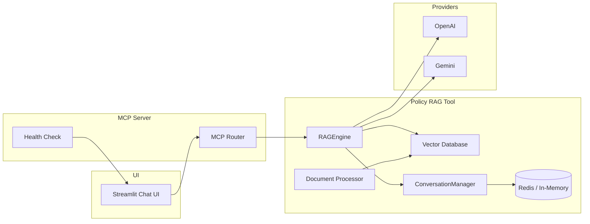

# How This Project Works

This document provides a clear, end-to-end explanation of the HR Assistant project: its architecture, core components, data flow, caching and warm-up strategies, and how everything fits together for fast, grounded answers.

## Overview

The HR Assistant answers employee questions using company policy documents. It retrieves relevant context from a vector database and generates grounded responses via an LLM (OpenAI or Gemini), including citations. It also supports a Basic (retrieval-only) fallback mode.

High-level goals:
- Keep the UI simple, responsive, and accessible
- Ground answers in policy documents with citations
- Minimize latency by pre-warming and caching conversation summaries
- Allow flexible provider choice (OpenAI/Gemini/Auto) with a Low-Latency mode

## Architecture

Core layers:
- UI (Streamlit): Chat interface, status, streaming, settings
- MCP Server + Router: Orchestration and health checks
- Tools (Policy RAG): Document processing, vector search, and RAG
- LLM Providers: OpenAI and Gemini (auto selection and fallback)
- Cache: Redis (with in-memory fallback) for conversation summaries



## Components

### 1) Streamlit UI (`ui/streamlit_app.py`)
- Minimalist, monochrome theme; responsive layout; accessible focus styling
- Sticky input at the bottom with independent chat scroll
- Streaming responses (simulated word chunks) for faster perceived latency
- Commands: `/clear`, `/help`, `/provider openai|gemini|auto`
- Settings:
  - Search results (Top-K)
  - Low-latency mode (prefer faster provider/models or Basic)
  - Fast responses (smaller search context for speed)
- Status badges show: Docs count, Active Provider, Mode (AI or Basic)
- Sources expander lists the retrieved chunks (file, page, relevance)
- Uses conversation summaries to shrink prompt context

### 2) MCP Server + Router (`mcp_server/server.py`)
- Provides a central place to register tools and run basic health checks
- The UI calls its health endpoint to show system status (Healthy/Issues)
- The router is a lightweight orchestrator; tools are discovered and used by the UI layer

### 3) PolicySearchTool (`tools/policy_rag/mcp_tool.py`)
- Thin wrapper exposing:
  - `search_policies(query, top_k)` → returns relevant chunks with metadata
  - `get_database_stats()` → counts of chunks/documents, health indicators
- Internally uses the Vector Database and embedding model for similarity search

### 4) Vector Database (`tools/policy_rag/vector_database.py`)
- Stores and indexes document chunks (Chroma DB)
- Provides similarity search by embedding queries vs. chunk vectors
- Exposes stats used by the UI (e.g., `unique_documents`, `total_chunks`)

### 5) Document Processor (`tools/policy_rag/document_processor.py`)
- Converts PDFs/text to chunks with smart splitting and overlap
- Extracts metadata (filename, page) for later citations
- Used by setup/ingest to populate the vector database

### 6) RAG Engine (`tools/policy_rag/rag_engine.py`)
- Central logic for Retrieval Augmented Generation
- Key capabilities:
  - Provider selection: `openai`, `gemini`, or `auto` (prefer OpenAI, fallback to Gemini)
  - Prompt creation: includes document context, optional conversation summary, and recent turns
  - Response generation: tries active provider; if all fail, falls back to a Basic (retrieval-only) response with citations
  - Low-latency mode: temporarily adjusts max tokens, temperature, and uses faster models
  - Provider switching at runtime via `set_provider()`
- Important methods:
  - `create_rag_prompt(user_question, retrieved_chunks, conversation_history, conversation_summary)`
  - `generate_response(...)` → returns the text, model/provider used, and chunk metadata
  - `generate_fallback_response(...)` → builds a grounded answer from chunks only

### 7) Conversation Manager (`tools/policy_rag/rag_engine.py`)
- Manages per-user chat history and trimming
- Produces a compact summary (no LLM call) of the last few turns
- Reads/writes summaries to cache with TTL to reduce repeated work
- API:
  - `add_turn(user_id, role, content)`
  - `get_history(user_id)` / `clear_history(user_id)`
  - `get_or_update_summary(user_id)` → summarization + cache

### 8) Cache Layer (`tools/cache/redis_cache.py`)
- Provides `get_cache()`:
  - If Redis library/server available: returns Redis-backed cache
  - Otherwise: returns an in-memory fallback
- JSON convenience methods:
  - `get_json(key)` / `set_json(key, value)`
  - `set_json_ttl(key, value, ttl_seconds)`
  - `delete(key)`
- Key used: `conv:summary:<user_id>` (default ~30 min TTL)

### 9) Warm-up Script (`scripts/warmup.py`)
- Pre-warms vector search and the LLM provider to reduce first-response latency
- Safe to run at process startup or via a pre-launch step

### 10) Setup / Ingest (`setup.py`)
- Processes documents and builds/updates the vector database
- Skips re-processing if existing chunks are already present (to save time)

## Data Flow

1) User types a question → UI
2) UI records the user turn in `ConversationManager`
3) UI retrieves search results from `PolicySearchTool` (Top-K)
4) UI fetches a conversation summary (from cache, or generates it quickly)
5) UI calls `RAGEngine.generate_response(...)` with:
   - question, retrieved chunks, last one or two turns, and the summary
   - low-latency setting (if enabled)
6) RAG Engine selects the active provider (or falls back to Basic)
7) Response is streamed to the UI (simulated word chunks)
8) UI displays sources/citations and updates history

## Low-Latency Mode

When enabled:
- Caps `max_tokens` (default 350) and sets lower temperature (default 0.0)
- Temporarily switches to faster models (if configured):
  - `FAST_OPENAI_MODEL` (e.g., `gpt-3.5-turbo`)
  - `FAST_GEMINI_MODEL` (e.g., `gemini-1.5-flash`)
- If no provider is configured, the UI still returns fast Basic (retrieval-only) answers

Environment overrides:
- `LOW_LATENCY_MAX_TOKENS` (default 350)
- `LOW_LATENCY_TEMPERATURE` (default 0.0)
- `LOW_LATENCY_BASIC_ONLY=true` to force retrieval-only in low-latency contexts

## Caching Strategy

- Conversation summaries are cached per session to reduce prompt size and speed up follow-ups.
- Redis is preferred; if not available, an in-memory per-process cache is used.
- Cache key: `conv:summary:<user_id>` with ~30 minutes TTL (configurable in code).

## Configuration

Environment variables (examples):

```
# Providers
OPENAI_API_KEY=...
GEMINI_API_KEY=...
GEMINI_MODEL=gemini-1.5-pro

# Vector DB
VECTOR_DB_PATH=./data/vector_db
VECTOR_DB_COLLECTION_NAME=hr_policies
HR_DOCUMENTS_PATH=./data/hr_documents
EMBEDDING_MODEL=all-MiniLM-L6-v2

# Redis cache (optional)
REDIS_URL=redis://localhost:6379/0
# or
REDIS_HOST=localhost
REDIS_PORT=6379
REDIS_DB=0

# Low-latency tuning
FAST_OPENAI_MODEL=gpt-3.5-turbo
FAST_GEMINI_MODEL=gemini-1.5-flash
LOW_LATENCY_MAX_TOKENS=350
LOW_LATENCY_TEMPERATURE=0.0
```

## Running Locally (Windows PowerShell)

```powershell
# 1) Install dependencies
pip install -r requirements.txt

# 2) (Optional) Warm-up to reduce first-response latency
python scripts/warmup.py

# 3) Start the UI
streamlit run ui/streamlit_app.py
```

## Extending the System

- Add Providers: Implement additional provider adapters and register selection rules.
- Change Vector DB: Swap Chroma with Pinecone, Milvus, etc., by replacing the vector database adapter methods.
- Improve Summaries: Replace the heuristic summarizer with a compact LLM-based summary cached per session.
- UI: Add conversation persistence/export, advanced citations, error retry/backoff.

## Troubleshooting

- No AI Responses: Check `OPENAI_API_KEY` or `GEMINI_API_KEY`. The UI will fall back to Basic mode.
- Slow First Response: Run `python scripts/warmup.py` and enable Low-Latency mode.
- Cache Warnings: If Redis is not available, the app uses in-memory cache; to use Redis, set `REDIS_URL` and ensure the server is reachable.
- No Documents: Re-run `python setup.py` to process documents.

---

This document covers how each component works, how data flows through the system, and the strategies we use for performance (low-latency + warm-up) and efficiency (summary caching).