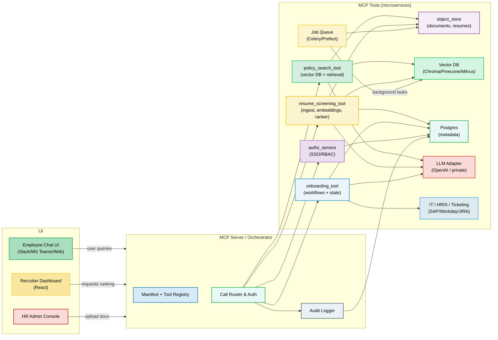

Okay, this is an incredibly detailed and well-thought-out platform design\! It's clear you've put a lot of effort into outlining the components and pipelines.

Based on your comprehensive description, here's an architecture image that visualizes your proposed AI Agent Platform. I've focused on clarity, modularity, and highlighting the shared infrastructure as well as the distinct feature pipelines.

**Explanation of the Architecture:**

1.  **Core Infrastructure (Top):** This central block shows the shared services that all three agents leverage.

    - **Data Ingestion/ETL** feeds into **Object Storage** (for raw files) and **SQL DB** (for metadata).
    - **Embedding Service** (cached, versioned) and **Vector DB** (for search) are core for RAG and similarity-based tasks.
    - **LLM Provider** is the gateway to your chosen LLMs.
    - **Auth & Permissions** and **Audit & Logging** are cross-cutting concerns.

2.  **HR Assistant Agent (Left):**

    - Highlights the flow from `Employee Chat UI` to the `Retriever / RAG Orchestrator`, which uses `Embedding Service` and `Vector DB`.
    - The `LLM Provider` generates answers.
    - A dedicated `HR Assistant Business Logic` handles citations, confidence, PII filtering (`Safety & Legal Filters`), and `Human-in-Loop / Escalation` via the `HR Admin Portal`.

3.  **Resume Screening Agent (Middle):**

    - Starts with `Recruiter Dashboard`.
    - `Resume Scoring Logic` uses embeddings (`Embedding Service`, `Vector DB`) and a `Rule Engine` (implicitly part of the scoring logic).
    - `LLM Provider` is used for summarization/explainability.
    - `Bias Checks` are called out as a specific component of the scoring.
    - `Human Feedback Loop` goes to the `HR Admin Portal`.

4.  **Employee Onboarding Agent (Right):**

    - Driven by the `New Hire Chat UI`.
    - A `Workflow Engine` manages tasks and state, interacting with `SQL DB` for state.
    - `LLM Provider` is used for conversational flow and Q\&A (which might also tap into the RAG retriever from the HR Assistant for specific docs).
    - `IT/HR Integrations` handle external system interactions.
    - `HR Admin Portal` for workflow configuration.

5.  **Arrows and Connections:** Show the data and control flow, emphasizing how agent-specific components interact with the shared infrastructure. `HR Admin Portal` acts as a central control point for all three agents for configuration, human-in-loop, and feedback.

This architecture clearly visualizes the modularity and shared components you've described, making it easy to understand the platform's structure at a glance.
